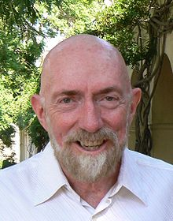

<table class="infobox biography vcard">
<tbody>
<tr>
<th colspan="2">

Kip Thorne

</th>
</tr>
<tr>
<td colspan="2">

Thorne in August 2007

</td>
</tr>
<tr>
<th scope="row">Born</th>
<td>

Kip Stephen Thorne

 June 1, 1940&nbsp;(age&nbsp;80) 

<a title="Logan, Utah" href="https://en.wikipedia.org/wiki/Logan,_Utah">Logan, Utah</a>, U.S.

</td>
</tr>
<tr>
<th scope="row">Education</th>
<td><a title="California Institute of Technology" href="https://en.wikipedia.org/wiki/California_Institute_of_Technology">California Institute of Technology</a>&nbsp;(<a title="Bachelor of Science" href="https://en.wikipedia.org/wiki/Bachelor_of_Science">B.S.</a>) <a title="Princeton University" href="https://en.wikipedia.org/wiki/Princeton_University">Princeton University</a>&nbsp;(<a title="Master of Science" href="https://en.wikipedia.org/wiki/Master_of_Science">M.S.</a>,&nbsp;<a title="Doctor of Philosophy" href="https://en.wikipedia.org/wiki/Doctor_of_Philosophy">Ph.D.</a>)</td>
</tr>
<tr>
<th scope="row">Known&nbsp;for</th>
<td><a title="Thorne&ndash;Żytkow object" href="https://en.wikipedia.org/wiki/Thorne%E2%80%93%C5%BBytkow_object">Thorne-Żytkow object</a> <a title="Roman ring" href="https://en.wikipedia.org/wiki/Roman_ring">Roman arch</a> <a title="Thorne&ndash;Hawking&ndash;Preskill bet" href="https://en.wikipedia.org/wiki/Thorne%E2%80%93Hawking%E2%80%93Preskill_bet">Thorne-Hawking-Preskill bet</a> <a title="LIGO" href="https://en.wikipedia.org/wiki/LIGO">LIGO</a> <a title="Gravitational wave" href="https://en.wikipedia.org/wiki/Gravitational_wave">Gravitational waves</a> <em><a title="Gravitation (book)" href="https://en.wikipedia.org/wiki/Gravitation_(book)">Gravitation</a></em></td>
</tr>
<tr>
<th scope="row">Spouse(s)</th>
<td>

Linda Jean Peterson

&nbsp;

(<abbr title="married">m.</abbr>&nbsp;1960;&nbsp;<abbr title="divorced">div.</abbr>&nbsp;1977)

 

Carolee Joyce Winstein

&nbsp;

(<abbr title="married">m.</abbr>&nbsp;1984)

</td>
</tr>
<tr>
<th scope="row">Children</th>
<td>2</td>
</tr>
<tr>
<th scope="row">Awards</th>
<td><a title="Lilienfeld Prize" href="https://en.wikipedia.org/wiki/Lilienfeld_Prize">Lilienfeld Prize</a>&nbsp;(1996) <a title="Albert Einstein Medal" href="https://en.wikipedia.org/wiki/Albert_Einstein_Medal">Albert Einstein Medal</a>&nbsp;(2009) <a title="Breakthrough Prize in Fundamental Physics" href="https://en.wikipedia.org/wiki/Breakthrough_Prize_in_Fundamental_Physics">Special Breakthrough Prize in Fundamental Physics</a>&nbsp;(2016) <a title="Gruber Prize in Cosmology" href="https://en.wikipedia.org/wiki/Gruber_Prize_in_Cosmology">Gruber Prize in Cosmology</a>&nbsp;(2016) <a title="Shaw Prize" href="https://en.wikipedia.org/wiki/Shaw_Prize">Shaw Prize</a>&nbsp;(2016) <a title="Kavli Prize" href="https://en.wikipedia.org/wiki/Kavli_Prize">Kavli Prize</a>&nbsp;(2016) <a title="Harvey Prize" href="https://en.wikipedia.org/wiki/Harvey_Prize">Harvey Prize</a>&nbsp;(2016) <a class="mw-redirect" title="Princess of Asturias Award" href="https://en.wikipedia.org/wiki/Princess_of_Asturias_Award">Princess of Asturias Award</a>&nbsp;(2017) <a title="Nobel Prize in Physics" href="https://en.wikipedia.org/wiki/Nobel_Prize_in_Physics">Nobel Prize in Physics</a>&nbsp;(2017) <a title="Lewis Thomas Prize" href="https://en.wikipedia.org/wiki/Lewis_Thomas_Prize">Lewis Thomas Prize</a>&nbsp;(2018)</td>
</tr>
<tr>
<td colspan="2"><strong>Scientific career</strong></td>
</tr>
<tr>
<th scope="row">Fields</th>
<td class="category"><a title="Astrophysics" href="https://en.wikipedia.org/wiki/Astrophysics">Astrophysics</a> <a class="mw-redirect" title="Gravitational physics" href="https://en.wikipedia.org/wiki/Gravitational_physics">Gravitational physics</a></td>
</tr>
<tr>
<th scope="row">Institutions</th>
<td><a title="California Institute of Technology" href="https://en.wikipedia.org/wiki/California_Institute_of_Technology">California Institute of Technology</a></td>
</tr>
<tr>
<th scope="row"><a title="Thesis" href="https://en.wikipedia.org/wiki/Thesis">Thesis</a></th>
<td><a class="external text" href="https://search.proquest.com/docview/302136891/" rel="nofollow"><em>Geometrodynamics of cylindrical systems</em></a>&nbsp;(1965)</td>
</tr>
<tr>
<th scope="row"><a title="Doctoral advisor" href="https://en.wikipedia.org/wiki/Doctoral_advisor">Doctoral advisor</a></th>
<td><a title="John Archibald Wheeler" href="https://en.wikipedia.org/wiki/John_Archibald_Wheeler">John Archibald Wheeler</a></td>
</tr>
<tr>
<th scope="row">Doctoral students</th>
<td><a title="William L. Burke" href="https://en.wikipedia.org/wiki/William_L._Burke">William L. Burke</a> <a title="Carlton M. Caves" href="https://en.wikipedia.org/wiki/Carlton_M._Caves">Carlton M. Caves</a> <a title="Lee Samuel Finn" href="https://en.wikipedia.org/wiki/Lee_Samuel_Finn">Lee Samuel Finn</a> <a title="S&aacute;ndor J. Kov&aacute;cs" href="https://en.wikipedia.org/wiki/S%C3%A1ndor_J._Kov%C3%A1cs">S&aacute;ndor J. Kov&aacute;cs</a> <a title="David L. Lee" href="https://en.wikipedia.org/wiki/David_L._Lee">David L. Lee</a> <a title="Alan Lightman" href="https://en.wikipedia.org/wiki/Alan_Lightman">Alan Lightman</a> <a title="Don Page (physicist)" href="https://en.wikipedia.org/wiki/Don_Page_(physicist)">Don N. Page</a> <a title="William H. Press" href="https://en.wikipedia.org/wiki/William_H._Press">William H. Press</a> <a title="Richard H. Price" href="https://en.wikipedia.org/wiki/Richard_H._Price">Richard H. Price</a> <a title="Bernard F. Schutz" href="https://en.wikipedia.org/wiki/Bernard_F._Schutz">Bernard F. Schutz</a> <a title="Saul Teukolsky" href="https://en.wikipedia.org/wiki/Saul_Teukolsky">Saul Teukolsky</a> <a title="Clifford Martin Will" href="https://en.wikipedia.org/wiki/Clifford_Martin_Will">Clifford Martin Will</a></td>
</tr>
</tbody>
</table>
 

<strong>Kip Stephen Thorne</strong>&nbsp;(born June&nbsp;1, 1940) is an American&nbsp;<a title="Theoretical physics" href="https://en.wikipedia.org/wiki/Theoretical_physics">theoretical physicist</a> known for his contributions in <a class="mw-redirect" title="Gravitation" href="https://en.wikipedia.org/wiki/Gravitation">gravitational physics</a> and <a title="Astrophysics" href="https://en.wikipedia.org/wiki/Astrophysics">astrophysics</a>. A longtime friend and colleague of <a title="Stephen Hawking" href="https://en.wikipedia.org/wiki/Stephen_Hawking">Stephen Hawking</a> and <a title="Carl Sagan" href="https://en.wikipedia.org/wiki/Carl_Sagan">Carl Sagan</a>, he was the&nbsp;<a title="Richard Feynman" href="https://en.wikipedia.org/wiki/Richard_Feynman">Feynman</a>&nbsp;Professor of Theoretical Physics at the&nbsp;<a title="California Institute of Technology" href="https://en.wikipedia.org/wiki/California_Institute_of_Technology">California Institute of Technology</a>&nbsp;(Caltech) until 2009&nbsp;and is one of the world's leading experts on the astrophysical implications of&nbsp;<a title="Albert Einstein" href="https://en.wikipedia.org/wiki/Albert_Einstein">Einstein's</a>&nbsp;<a title="General relativity" href="https://en.wikipedia.org/wiki/General_relativity">general theory of relativity</a>. He continues to do scientific research and scientific consulting, most notably for the&nbsp;<a title="Christopher Nolan" href="https://en.wikipedia.org/wiki/Christopher_Nolan">Christopher Nolan</a>&nbsp;film&nbsp;<em><a title="Interstellar (film)" href="https://en.wikipedia.org/wiki/Interstellar_(film)">Interstellar</a></em>.&nbsp;Thorne was awarded the 2017&nbsp;<a title="Nobel Prize in Physics" href="https://en.wikipedia.org/wiki/Nobel_Prize_in_Physics">Nobel Prize in Physics</a>&nbsp;along with&nbsp;<a title="Rainer Weiss" href="https://en.wikipedia.org/wiki/Rainer_Weiss">Rainer Weiss</a>&nbsp;and&nbsp;<a class="mw-redirect" title="Barry C. Barish" href="https://en.wikipedia.org/wiki/Barry_C._Barish">Barry C. Barish</a>&nbsp;"for decisive contributions to the&nbsp;<a title="Gravitational-wave observatory" href="https://en.wikipedia.org/wiki/Gravitational-wave_observatory">LIGO detector</a>&nbsp;and the observation of&nbsp;<a title="Gravitational wave" href="https://en.wikipedia.org/wiki/Gravitational_wave">gravitational waves</a>".

 

<h2> Publications </h2>

<ul>

                             

 <li><a target="_blank" href="https://github.com/manjunath5496/Kip-S-Thorne-Publications/blob/master/kstp(1).pdf" style="text-decoration:none;">Post-Newtonian Approximation in Maxwell-Like Form</a></li>

 <li><a target="_blank" href="https://github.com/manjunath5496/Kip-S-Thorne-Publications/blob/master/kstp(2).pdf" style="text-decoration:none;">Momentum Flow in Black Hole Binaries: I. Post-Newtonian Analysis of the Inspiral and Spin-Induced Bobbing</a></li>

<li><a target="_blank" href="https://github.com/manjunath5496/Kip-S-Thorne-Publications/blob/master/kstp(3).pdf" style="text-decoration:none;">Frame-Dragging Vortexes and Tidal Tendexes Attached to Colliding Black Holes: Visualizing the Curvature of Spacetime</a></li>
 <li><a target="_blank" href="https://github.com/manjunath5496/Kip-S-Thorne-Publications/blob/master/kstp(4).pdf" style="text-decoration:none;">Visualizing Spacetime Curvature via Frame-Drag Vortexes and Tidal Tendexes: I. General Theory and Weak-Gravity Applications</a></li>                              
<li><a target="_blank" href="https://github.com/manjunath5496/Kip-S-Thorne-Publications/blob/master/kstp(5).pdf" style="text-decoration:none;">Visualizing Spacetime Curvature via Frame-Drag Vortexes and Tidal Tendexes: II. Stationary Black Holes</a></li>
<li><a target="_blank" href="https://github.com/manjunath5496/Kip-S-Thorne-Publications/blob/master/kstp(6).pdf" style="text-decoration:none;">Visualizing Spacetime Curvature via Frame-Drag Vortexes and Tidal Tendexes: III. Quasinormal Pulsations of Schwarzschild and Kerr Black Holes</a></li>
 <li><a target="_blank" href="https://github.com/manjunath5496/Kip-S-Thorne-Publications/blob/master/kstp(7).pdf" style="text-decoration:none;">Gravitational Lensing by Spinning Black Holes in Astrophysics, and in the Movie Interstellar</a></li>

 <li><a target="_blank" href="https://github.com/manjunath5496/Kip-S-Thorne-Publications/blob/master/kstp(8).pdf" style="text-decoration:none;"> Visualizing Interstellar's Wormhole</a></li>
   <li><a target="_blank" href="https://github.com/manjunath5496/Kip-S-Thorne-Publications/blob/master/kstp(9).pdf" style="text-decoration:none;">General Relativity for Pedestrians - First 6 lectures</a></li>
  
   
 <li><a target="_blank" href="https://github.com/manjunath5496/Kip-S-Thorne-Publications/blob/master/kstp(10).pdf" style="text-decoration:none;">Geometrodynamics: The Nonlinear Dynamics of Curved Spacetime</a></li>                              
<li><a target="_blank" href="https://github.com/manjunath5496/Kip-S-Thorne-Publications/blob/master/kstp(11).pdf" style="text-decoration:none;">Spectroscopic Binaries and Collapsed Stars: Part II</a></li>
<li><a target="_blank" href="https://github.com/manjunath5496/Kip-S-Thorne-Publications/blob/master/kstp(12).pdf" style="text-decoration:none;">John Archibald Wheeler, 1911—2008: A Biographical Memoir</a></li>
<li><a target="_blank" href="https://github.com/manjunath5496/Kip-S-Thorne-Publications/blob/master/kstp(13).pdf" style="text-decoration:none;">Stephen William Hawking CH CBE
8 January 1942 – 14 March 2018 Elected FRS 1974</a></li>

<li><a target="_blank" href="https://github.com/manjunath5496/Kip-S-Thorne-Publications/blob/master/kstp(14).pdf" style="text-decoration:none;">The Transition from Inspiral to Plunge for a Compact Body in a Circular Equatorial Orbit Around a Massive, Spinning Black Hole</a></li>
                              
<li><a target="_blank" href="https://github.com/manjunath5496/Kip-S-Thorne-Publications/blob/master/kstp(15).pdf" style="text-decoration:none;">Gravitational Waves from a Compact Star in a Circular, Inspiral Orbit, in the Equatorial Plane of a Massive, Spinning Black Hole, as Observed by LISA</a></li>

<li><a target="_blank" href="https://github.com/manjunath5496/Kip-S-Thorne-Publications/blob/master/kstp(16).pdf" style="text-decoration:none;">Conversion of conventional gravitational-wave interferometers into QND interferometers by modifying their input and/or output optics</a></li>

  <li><a target="_blank" href="https://github.com/manjunath5496/Kip-S-Thorne-Publications/blob/master/kstp(17).pdf" style="text-decoration:none;">The noise in gravitational-wave detectors and other classical-force measurements is not influenced by test-mass quantization</a></li>   
  
<li><a target="_blank" href="https://github.com/manjunath5496/Kip-S-Thorne-Publications/blob/master/kstp(18).pdf" style="text-decoration:none;">An Overview of Gravitational-Wave Sources</a></li> 

  
<li><a target="_blank" href="https://github.com/manjunath5496/Kip-S-Thorne-Publications/blob/master/kstp(19).pdf" style="text-decoration:none;">Reducing Thermoelastic Noise in Gravitational-Wave Interferometers by Flattening the Light Beams</a></li> 

<li><a target="_blank" href="https://github.com/manjunath5496/Kip-S-Thorne-Publications/blob/master/kstp(20).pdf" style="text-decoration:none;">A New Family of Light Beams and Mirror Shapes for Future LIGO Interferometers</a></li>

<li><a target="_blank" href="https://github.com/manjunath5496/Kip-S-Thorne-Publications/blob/master/kstp(21).pdf" style="text-decoration:none;">Prospects for Detection of Gravitational Waves from Intermediate-Mass-Ratio Inspirals</a></li>
<li><a target="_blank" href="https://github.com/manjunath5496/Kip-S-Thorne-Publications/blob/master/kstp(22).pdf" style="text-decoration:none;">The Last Three Minutes: Issues in Gravitational Wave Measurements of Coalescing Compact Binaries</a></li> 
 <li><a target="_blank" href="https://github.com/manjunath5496/Kip-S-Thorne-Publications/blob/master/kstp(23).pdf" style="text-decoration:none;">The Quantum Propagator for a Nonrelativistic Particle in the Vicinity of a Time Machine</a></li> 
 

   <li><a target="_blank" href="https://github.com/manjunath5496/Kip-S-Thorne-Publications/blob/master/kstp(24).pdf" style="text-decoration:none;">Gravitational Waves from Compact Bodies</a></li>
 
   <li><a target="_blank" href="https://github.com/manjunath5496/Kip-S-Thorne-Publications/blob/master/kstp(25).pdf" style="text-decoration:none;">Gravitational Waves</a></li>                              
 <li><a target="_blank" href="https://github.com/manjunath5496/Kip-S-Thorne-Publications/blob/master/kstp(26).pdf" style="text-decoration:none;">Gravitational Radiation: A New Window Onto the Universe</a></li>
 <li><a target="_blank" href="https://github.com/manjunath5496/Kip-S-Thorne-Publications/blob/master/kstp(27).pdf" style="text-decoration:none;">Tidal Stabilization of Rigidly Rotating, Fully Relativistic Neutron Stars</a></li>
   
 
   <li><a target="_blank" href="https://github.com/manjunath5496/Kip-S-Thorne-Publications/blob/master/kstp(28).pdf" style="text-decoration:none;">Probing Black Holes and Relativistic Stars with Gravitational Waves</a></li>
 
   <li><a target="_blank" href="https://github.com/manjunath5496/Kip-S-Thorne-Publications/blob/master/kstp(29).pdf" style="text-decoration:none;">Gravitational Waves from Coalescing Black Hole MACHO Binaries</a></li>                              

  <li><a target="_blank" href="https://github.com/manjunath5496/Kip-S-Thorne-Publications/blob/master/kstp(30).pdf" style="text-decoration:none;">Computing the merger of black-hole binaries: the IBBH problem</a></li>
 
   <li><a target="_blank" href="https://github.com/manjunath5496/Kip-S-Thorne-Publications/blob/master/kstp(31).pdf" style="text-decoration:none;">Seismic gravity-gradient noise in interferometric gravitational-wave detectors</a></li> 
    <li><a target="_blank" href="https://github.com/manjunath5496/Kip-S-Thorne-Publications/blob/master/kstp(32).pdf" style="text-decoration:none;">Numerical Relativity for Inspiraling Binaries in Co-Rotating Coordinates: Test Bed for Lapse and Shift Equations</a></li> 

   <li><a target="_blank" href="https://github.com/manjunath5496/Kip-S-Thorne-Publications/blob/master/kstp(33).pdf" style="text-decoration:none;">Human gravity-gradient noise in interferometric gravitational-wave detectors</a></li>                              

  <li><a target="_blank" href="https://github.com/manjunath5496/Kip-S-Thorne-Publications/blob/master/kstp(34).pdf" style="text-decoration:none;">Dual-resonator speed meter for a free test mass</a></li> 
 
  <li><a target="_blank" href="https://github.com/manjunath5496/Kip-S-Thorne-Publications/blob/master/kstp(35).pdf" style="text-decoration:none;">Energetic Quantum Limit in Large-Scale Interferometers</a></li> 

  <li><a target="_blank" href="https://github.com/manjunath5496/Kip-S-Thorne-Publications/blob/master/kstp(36).pdf" style="text-decoration:none;">Thermoelastic noise and homogeneous thermal noise in finite sized gravitational-wave test masses</a></li> 
    <li><a target="_blank" href="https://github.com/manjunath5496/Kip-S-Thorne-Publications/blob/master/kstp(37).pdf" style="text-decoration:none;">Ligo and the Discovery of
Gravitational Waves, III</a></li>
  </ul>
